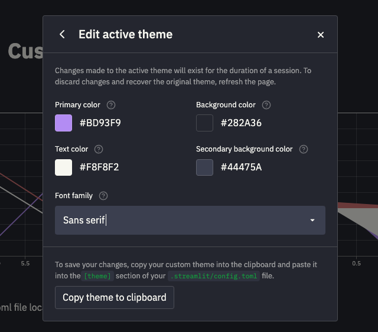
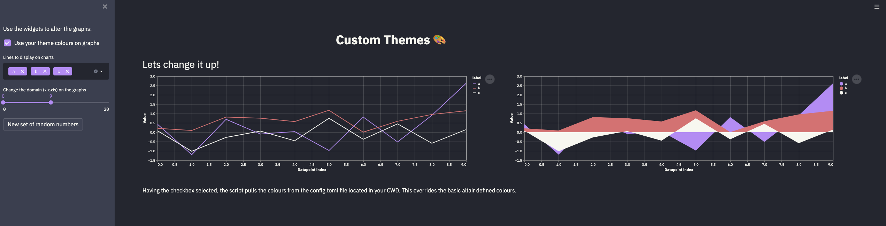

# Dracula for [Steamlit](https://streamlit.io/)

> A dark theme for [Steamlit](https://streamlit.io/).

*Note that Streamlit currently only allows for the setting of two background colors, a primary color, and the text color.*

## Install

All instructions can be found in [INSTALL.md](./INSTALL.md).

## Team

This theme is maintained by the following person(s) and a bunch of [awesome contributors](https://github.com/dracula/streamlit/graphs/contributors).

 |
--- |
[Taylor Rogers](https://github.com/twrogers1)

## License

[MIT License](./LICENSE)
